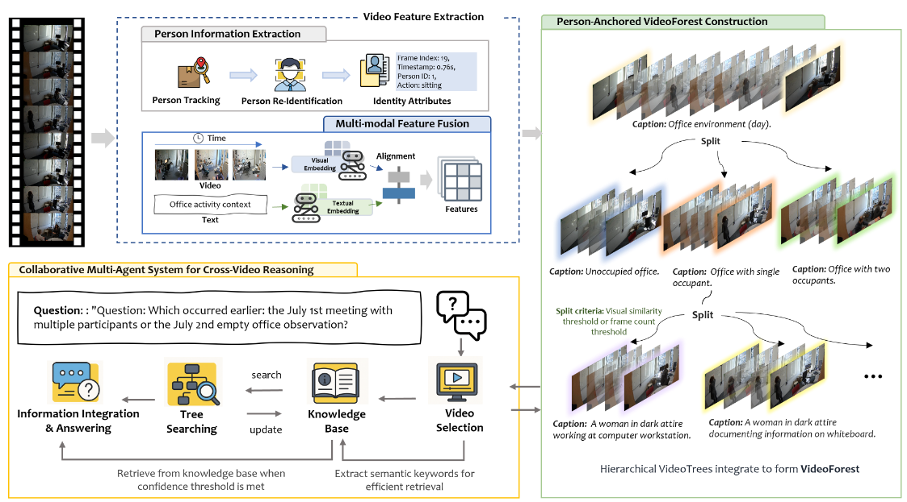

# 🌲 VideoForest: Person-Anchored Hierarchical Reasoning for Cross-Video Question Answering

**VideoForest** is a novel framework for **cross-video question answering (CVQA)**.  

This project is accepted at [**ACM Multimedia 2025**](https://openreview.net/forum?id=bUioJlKXN6)

---

## 🎯 Motivation

Understanding human behavior and answering questions across multiple video sources is critical in:

- 🎥 Story-level video understanding
- 🕵️ Surveillance and multi-camera tracking
- 🧠 High-level temporal-spatial reasoning

Existing video QA models operate on **single clips**, lacking the ability to **align and reason across videos**.  
**VideoForest** addresses this gap through structured, multi-layered reasoning centered on **person instances**.

---
## 🧩 Key Contributions
✅ We introduce the first person-anchored hierarchical framework for cross-video question answering, pioneering a tree-based architecture that uses human subjects as bridge points to connect multiple video streams, enabling unified understanding across distributed visual information. 

✅ We develop an efficient multi-granular video organization strategy integrated with a multi-agent reasoning framework that preserves critical temporal-spatial relationships while making cross-video question answering computationally tractable. 

✅ We present CrossVideoQA, a novel benchmark dataset for evaluating person-centric cross-video question answering capabilities, establishing new evaluation protocols and performance baselines for this emerging research direction.

---

## 🌐 CrossVideoQA Dataset

We introduce [**CrossVideoQA**](https://github.com/liriar/CrossVideoQA), a benchmark for evaluating cross-video understanding.

> 📂 [Visit the CrossVideoQA Dataset →](https://github.com/liriar/CrossVideoQA)

---

## 🧠 Method Highlights

We design **VideoForest** around three key technical innovations:

1. **Person-Anchored Feature Extraction**  
   We introduce a person-anchored feature extraction mechanism that leverages Re-Identification (ReID) and tracking algorithms to establish consistent identity representations across multiple videos, constructing robust spatio-temporal associations across diverse camera views.

2. **Multi-Granularity Spanning Tree Structure**  
   We propose a hierarchical spanning tree that organizes visual content around person-level trajectories, enabling efficient navigation from coarse scene-level context to fine-grained behavioral cues.

3. **Multi-Agent Reasoning Framework**  
   We develop a multi-agent reasoning mechanism that traverses this hierarchical structure to perform sophisticated cross-video reasoning while maintaining computational efficiency.


---

🚧 Note: Code will be made publicly available before the conference.

---

## 📄 Citation

```bibtex
@inproceedings{anonymous2025videoforest,
  title     = {VideoForest: Person-Anchored Hierarchical Reasoning for Cross-Video Question Answering},
  author    = {Yiran Meng and Junhong Ye and Wei Zhou and Guanghui Yue and Xudong Mao and Ruomei Wang and Baoquan Zhao},
  booktitle = {ACM Multimedia 2025},
  year      = {2025},
  url       = {https://openreview.net/forum?id=bUioJlKXN6}
}

